# Hey 👋🏾 I am William Kendrick Coleman
In my heart I am an embedded engineer, though I am currently a physicst researching quantum algotithms to ensure quantum computing's use for research in materials, medicine, drug developement, genetics, etc.

## Currently listening to

## Academia
Visual representation of completed coursework attributed to areas I am interested in

