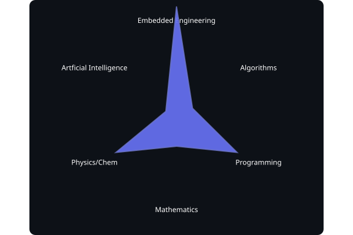

# Hey 👋🏾 I am William Kendrick Coleman, Device-Engineering Enthusiast and researcher

After graduating with my B.S. in Internet of Things from FIU in 2025, I chose to continue my academic trajectory by pursuing a M.S. in AI and IoT and later an M.S. in Electrical Engineering. I am currently formulating research, with the long-term goal of leveraging my hardware-software background to develop useful AI-integrated devices.

## Academia 📖

Visual representation of the areas of study I am interested and how many of my earned credits attribute to them.
- Each vertex represents 45 credits (the average amount of major-specific coursework in a given degree program).
- For self-study, completing a course-targeted book counts for 2 credits

Music is sort of the love of my life, so this next section is an homage to what my ear hairs have been vibrating to 😌

## Currently listening to... 🎧

